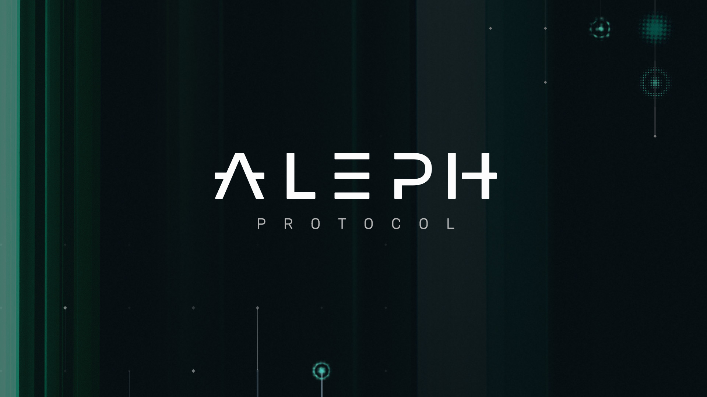

[![Crate][crate-image]][crate-link]
[![Docs][docs-image]][docs-link]
[![Build Status][build-image]][build-link]
[![Apache 2.0 Licensed][license-image]][license-link]
![Rust Stable][rustc-image]

### Aleph Consensus



### Overview

Aleph is an asynchronous and Byzantine fault tolerant consensus protocol aimed
at ordering arbitrary messages (transactions). It has been designed to operate
continuously under conditions where there is no bound on message-delivery delay
and under the assumption that there is a significant probability of malicious
behavior, making it an excellent fit for blockchain-related applications.
For more information, check [the paper][paper-link]

This repository contains a Rust implementation of AlephBFT that offers a convenient
API enabling seamless application to various problems. The prime application of
the repository is the consensus engine (sometimes called the "finality gadget")
of the [Aleph Zero blockchain][aleph-node-link].

### Detailed documentation

If the crate's [documentation][docs-link] seems to be not comprehensive enough,
please refer to the [detailed version][reference-link].

### Implementation status

- current version is asynchronous, so it's driven by consensus events as opposed
  to some clock ticks
- while being asynchronous, the performance is still optimal in partially
  synchronous environment
- guaranteed safety even in asynchronous environment
- BFT - secure if less than one third of the committee is malicious
- secure against fork bombs, for details see [the paper][paper-link]
- network overhead optimized to not send all parents hashes but a bitmap and a control hash
- thorough testing, including malicious scenarios, and high code coverage

### Future work

- Asynchronous liveness is an important theoretical property and there is a lot of technical
  sophistication that comes in the design of AlephBFT in order to achieve it, however on the practical
  side there is still little evidence that performing such attacks against liveness in real-world
  scenarios is possible. Still, no matter how unlikely such attacks might be, we take them very
  seriously and plan to add randomness to AlephBFT in one of the future releases. We decided to go
  for a version without randomness first, as it gives an incredibly simple and at the same time
  secure and robust BFT consensus protocol. Adding randomness introduces some complexity into the
  protocol, so it makes sense to add it on top of a well-tested, working product. The API of the
  protocol will not change and we will make the use of randomness configurable.
- We see a big value in keeping a critical piece of code such as a consensus protocol as
  self-contained as possible, so we would like to get rid of the only major dependency -
  `parity-scale-codec`

### Using the crate

- Import AlephBFT in your crate
  ```toml
  [dependencies]
  aleph-bft = "^0.5"
  ```
- AlephBFT requires user to provide it with an implementation of the following traits:
  - The [DataIO][dataio-link] trait is an abstraction for a component that provides data items and allows to input ordered data items. `DataIO` is parametrized with a `Data` generic type representing the type of items we would like to order.
    ```rust
    pub trait DataIO<Data> {
        type Error: Debug;
        fn get_data(&self) -> Data;
        fn send_ordered_batch(&mut self, batch: Vec<Data>) -> Result<(), Self::Error>;
    }
    ```
  - The [KeyBox][keybox-link] trait is an abstraction for digitally signing arbitrary data and
    verifying signatures created by other nodes.
    ```rust
    pub trait KeyBox: Index + Clone + Send {
        type Signature: Signature;
        fn sign(&self, msg: &[u8]) -> Self::Signature;
        fn verify(&self, msg: &[u8], sgn: &Self::Signature, index: NodeIndex) -> bool;
    }
    ```
  - The [Network][network-link] trait defines the functionality we expect from the network layer:
    ```rust
    pub trait Network<H: Hasher, D: Data, S: Encode + Decode>: Send {
        fn send(&self, data: NetworkData<H, D, S>, recipient: Recipient);
        async fn next_event(&mut self) -> Option<NetworkData<H, D, S>>;
    }
    ```
- Having all the above traits implemented, one can create a [Committee Member][member-link] and
  run it as an asynchronous task with an execution engine of choice.

### Dependencies

The repository is mainly self-contained. It is implemented using Rust's async features and depends only on the
`futures` create from the standard library. Moreover, it has some usual dependencies like
`log` and `rand` and one bigger for encoding, namely `parity-scale-codec`. In future work, we plan to get
rid of this dependency.

### Examples

Currently we provide two basic examples of running AlephBFT. The first one: `dummy-honest` implements a committee member that is not
cryptographically secure and serves only as a working example of what traits need to be implemented and how to implement them.
The example may be run using:

    cargo run --example dummy_honest my_id n_members n_finalized

    my_id -- our index, 0-based
    n_members -- size of the committee
    n_finalized -- number of data to be finalized

The second example: `blockchain` is meant for benchmarking AlephBFT in the blockchain setting. It implements a simple round-robin blockchain assuming honest participation. The simplest way to run it is to use the provided script as follows (assuming we start in the root directory)

```
./examples/blockchain/run_blockchain 4
```
where `4` in the above is the number of committee members and can be replaced by any reasonable number. Running this script will result in generating log files `node0.log, node1.log, ...` corresponding to subsequent nodes. The achieved transactions per second should be among the final log messages in these files.

### Tests

There are many unit tests and several integration tests that may be run by standard command
`cargo test --lib` or `cargo test --lib --skip medium` if you want to run just small tests.
Alternatively, you may run the `run_local_pipeline.sh` script.

### Fuzzing

There are fuzzing tests that try to crash the whole application by creating arbitrary data for the network layer
and feeding it into the `member` implementation. To run those tests you need to install `afl` and `cargo-fuzz`.
`cargo-fuzz` requires you to use a nightly Rust toolchain. `afl` differs from `cargo-fuzz` in that it requires
so called corpus data to operate, i.e. some non-empty data set that do not crash the application.
Both tools are using LLVM's instrumentation capabilities in order to guide the fuzzing process basing on code-coverage statistics.

```sh
cargo install cargo-fuzz
cargo install afl
```

#### cargo-fuzz/libfuzzer

```sh
cd fuzz
cargo fuzz run --features="libfuzz" fuzz_target
```

#### afl

You will need to generate some `seed` data first in order to run it.

```sh
cd fuzz
# create some random input containing network data from a locally executed test
mkdir afl_in
cargo build --bin gen_fuzz
./target/debug/gen_fuzz >./afl_in/seed

cargo afl build --features="afl-fuzz" --bin fuzz_target_afl
cargo afl fuzz -i afl_in -o afl_out target/debug/fuzz_target_afl
```

The `gen_fuzz` bin is able to both generate and verify data for the afl tool.

```sh
cd fuzz
cargo build --bin gen_fuzz
./target/debug/gen_fuzz | ./target/debug/gen_fuzz --check-fuzz
```

### Code Coverage

You may generate the code coverage summary using the `gen_cov_data.sh` script and then a detailed
raport for every file with `cov_report.sh`. Make sure to first install all the required
tools with `install_cov_tools.sh`.

### Resources

- Papers: [current version][paper-link], [old version][old-paper-link]
- docs: [crate documentation][docs-link], [reference][reference-link]

### License

AlephBFT is licensed under the terms of the the Apache License 2.0.

### Founding

The implementation in this repository is founded by [Aleph Zero Foundation][webpage-link].

[//]: ### "badges"
[dataio-link]: https://cardinal-cryptography.github.io/AlephBFT/aleph_bft_api.html#311-dataio
[network-link]: https://cardinal-cryptography.github.io/AlephBFT/aleph_bft_api.html#312-network
[keybox-link]: https://cardinal-cryptography.github.io/AlephBFT/aleph_bft_api.html#313-keybox
[crate-image]: https://img.shields.io/crates/v/aleph-bft.svg
[crate-link]: https://crates.io/crates/aleph-bft
[docs-image]: https://docs.rs/aleph-bft/badge.svg
[docs-link]: https://docs.rs/aleph-bft
[build-image]: https://github.com/Cardinal-Cryptography/AlephBFT/workflows/CI/badge.svg
[build-link]: https://github.com/Cardinal-Cryptography/AlephBFT/actions?query=workflow%3ACI
[license-image]: https://img.shields.io/badge/license-Apache2.0-blue.svg
[license-link]: https://github.com/Cardinal-Cryptography/AlephBFT/blob/main/LICENSE
[rustc-image]: https://img.shields.io/badge/rustc-stable-blue.svg
[//]: ### "general links"
[reference-link]: https://Cardinal-Cryptography.github.io/AlephBFT/index.html
[paper-link]: https://arxiv.org/abs/1908.05156
[old-paper-link]: https://arxiv.org/abs/1810.05256
[aleph-node-link]: https://github.com/Cardinal-Cryptography/aleph-node
[webpage-link]: https://alephzero.org
